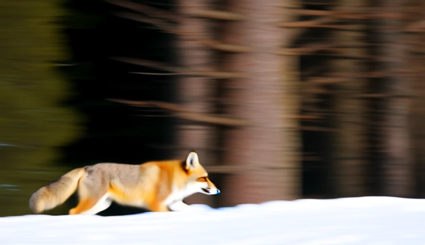

# Wan 2.1 Models

[Wan 2.1](https://github.com/Wan-Video/Wan2.1) is a family of video models.

For Wan 2.2 see: [Wan 2.2](../wan22)

## Files to Download

You will first need:

#### Text encoder and VAE:

[umt5_xxl_fp8_e4m3fn_scaled.safetensors](https://huggingface.co/Comfy-Org/Wan_2.1_ComfyUI_repackaged/tree/main/split_files/text_encoders) goes in: ComfyUI/models/text_encoders/

[wan_2.1_vae.safetensors](https://huggingface.co/Comfy-Org/Wan_2.1_ComfyUI_repackaged/blob/main/split_files/vae/wan_2.1_vae.safetensors) goes in: ComfyUI/models/vae/

#### Video Models

The diffusion models can be found [here](https://huggingface.co/Comfy-Org/Wan_2.1_ComfyUI_repackaged/tree/main/split_files/diffusion_models)

Note: The fp16 versions are recommended over the bf16 versions as they will give better results.

Quality rank (highest to lowest): fp16 > bf16 > fp8_scaled > fp8_e4m3fn

These files go in: ComfyUI/models/diffusion_models/

These examples use the 16 bit files but you can use the fp8 ones instead if you don't have enough memory.

## Workflows

### Text to Video

This workflow requires the [wan2.1_t2v_1.3B_fp16.safetensors](https://huggingface.co/Comfy-Org/Wan_2.1_ComfyUI_repackaged/blob/main/split_files/diffusion_models/wan2.1_t2v_1.3B_fp16.safetensors) file (put it in: ComfyUI/models/diffusion_models/). You can also use it with the 14B model.

[Workflow in Json format](text_to_video_wan.json)

### Image to Video

This workflow requires the [wan2.1_i2v_480p_14B_fp16.safetensors](https://huggingface.co/Comfy-Org/Wan_2.1_ComfyUI_repackaged/blob/main/split_files/diffusion_models/wan2.1_i2v_480p_14B_fp16.safetensors) file (put it in: ComfyUI/models/diffusion_models/) and 
[clip_vision_h.safetensors](https://huggingface.co/Comfy-Org/Wan_2.1_ComfyUI_repackaged/blob/main/split_files/clip_vision/clip_vision_h.safetensors) which goes in: ComfyUI/models/clip_vision/

Note this example only generates 33 frames at 512x512 because I wanted it to be accessible, the model can do more than that. The 720p model is pretty good if you have the hardware/patience to run it.

[Workflow in Json format](image_to_video_wan_example.json)

The input image can be found on the [flux](../flux) page.

Here's the same example with the [720p](https://huggingface.co/Comfy-Org/Wan_2.1_ComfyUI_repackaged/blob/main/split_files/diffusion_models/wan2.1_i2v_720p_14B_fp16.safetensors) model:

### VACE reference Image to Video

This workflow requires the [wan2.1_vace_14B_fp16.safetensors](https://huggingface.co/Comfy-Org/Wan_2.1_ComfyUI_repackaged/blob/main/split_files/diffusion_models/wan2.1_vace_14B_fp16.safetensors) file (put it in: ComfyUI/models/diffusion_models/)

This example generates a video from a reference image, this is different from generating a video from a start image. You'll notice that the video does not actually contain the reference image but is clearly derived from it.

[Workflow in Json format](vace_reference_to_video.json)

You can find the input image [here](../chroma/fennec_girl_sing.png) that image contains a [Chroma](../chroma) workflow if you are interested how it was generated.

### Image Camera to Video

This workflow requires the [wan2.1_fun_camera_v1.1_1.3B_bf16.safetensors](https://huggingface.co/Comfy-Org/Wan_2.1_ComfyUI_repackaged/blob/main/split_files/diffusion_models/wan2.1_fun_camera_v1.1_1.3B_bf16.safetensors) file (put it in: ComfyUI/models/diffusion_models/) and 
[clip_vision_h.safetensors](https://huggingface.co/Comfy-Org/Wan_2.1_ComfyUI_repackaged/blob/main/split_files/clip_vision/clip_vision_h.safetensors) which goes in: ComfyUI/models/clip_vision/ if you don't have it already.

[Workflow in Json format](camera_image_to_video_wan_example.json)

The input image can be found on the [flux](../flux) page.
